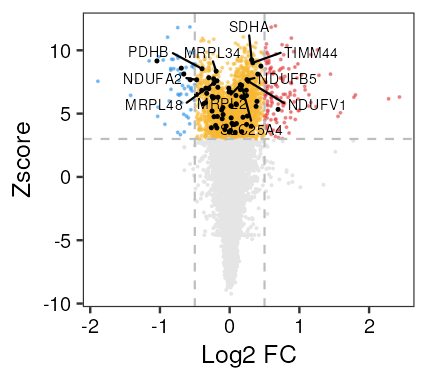
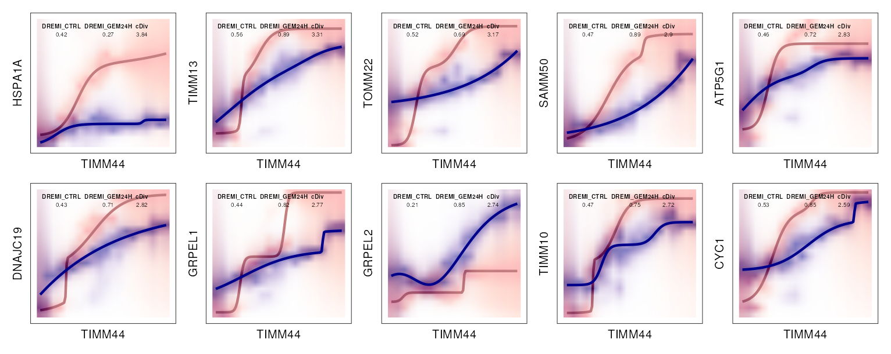
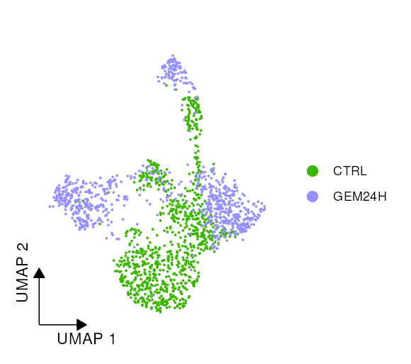
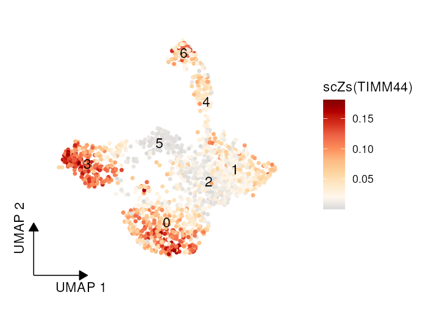

# scDNS

**scDNS** is a computational framework that quantifies **gene-specific functional perturbations at single-cell resolution**.
By leveraging **information-theoretic divergence**, scDNS systematically compares **gene network configurations** across different biological conditions, enabling precise characterization of cell-state-specific functional alterations.

---

## 🧩 Installation


## Install dependency packages
install Rmagic package
```r
if (!requireNamespace("devtools", quietly = TRUE)) install.packages("devtools")
# Creat scDNS Python environment
if (!requireNamespace('reticulate', quietly = TRUE)) install.packages('reticulate')

if (!dir.exists(reticulate::miniconda_path())) {
  message("Miniconda not found. Installing miniconda...")
  reticulate::install_miniconda()  # install miniconda
} else {
  message("Miniconda is already installed.")
}

reticulate::conda_create("scDNS", python_version = "3.8")
reticulate::use_condaenv("scDNS", required = TRUE)

# Install MAGIC Python package
if (!requireNamespace("Rmagic", quietly = TRUE)) devtools::install_github('cran/Rmagic')
reticulate::conda_install(envname = "scDNS", packages = "magic-impute", pip = TRUE)
Rmagic::pymagic_is_available() # test whether pymagic is available

```
Install the development version of **scDNS** from GitHub using:

```r
# If devtools is not installed

devtools::install_github("xiaolab-xjtu/scDNS")
```
---

## 🚀 Quick Start Example

This example demonstrates a typical analysis workflow using **scDNS** on scRNA-seq data.

Example data can be download from [here](https://drive.google.com/file/d/1RZQxfZLGGnEC0cX4R6aaw6JRklfzoEoI/view?usp=sharing).

### 1. Load and preprocess data

```r
library(scDNS)
library(patchwork)
library(dplyr)
library(reticulate)
library(Seurat) 
library(Rmagic)

# Activate Python environment
use_condaenv("scDNS")

# Increase global object size limit
options(future.globals.maxSize = 2 * 1024^3)

# Load example Seurat object
load(file = "./PANC1GEM24H_SOB_3.RData")

# Remove non-expressed genes
PANC1GEM24H_SOB_3 <- rmNotExpressedGene(PANC1GEM24H_SOB_3)
sob <- PANC1GEM24H_SOB_3
rm(PANC1GEM24H_SOB_3)
gc()
```
**Impute gene expression using MAGIC if not already available**

``` r
group_col <- "Type"       # experimental condition
if (!"MAGIC_RNA" %in% names(sob@assays)) {
  sob <- Magic4MultipleData(sob, split.by = group_col)
}
```

---

### 2. Create a `scDNS` object
Creat scDNS object from seurat object
```r
GEM_PANC1_scDNSob <- seurat2scDNSObj(
  sob = sob,
  GroupBy = group_col,
  imputedAssay = "MAGIC_RNA",
  parallel.sz = 4, # number of parallel processes (adjust based on available CPU cores)
  loop.size = 6000 # number of gene-gene interactions processed per parallel core 
)
```
Alternatively, we can create a scDNS object from a counts matrix and an imputed gene expression matrix.
``` r

CreatScDNSobject(
  counts = counts,
  data = imputedExp,	
  Network = NULL, # If no network is provided, the internal default network will be loaded.
  GroupLabel = group_vector,# group_vector is a vector indicating cell groups, e.g., c('g1','g1','g2','g2')
  parallel.sz = 4, # number of parallel processes (adjust based on available CPU cores)
  loop.size = 6000 # number of gene-gene interactions processed per parallel core 
  ) 

```
---

### 3. Compute network divergence
This step quantifies the **information-theoretic divergence** between gene networks across conditions.
```r
GEM_PANC1_scDNSob <- scDNS_1_CalDivs(GEM_PANC1_scDNSob)
```
---

### 4. Build a network ensemble model
A **network ensemble model** is constructed to integrate divergence values and estimate background distributions using random network permutations.
```r
GEM_PANC1_scDNSob <- scDNS_2_creatNEAModel_v2(
  scDNSobject = GEM_PANC1_scDNSob,
  n.randNet = 20000
)
```

---

### 5. Construct context-adaptive GINs

This step builds **context-adaptive gene interaction networks (GINs)** using a **graph attention network (GAT)** model, capturing **nonlinear gene dependencies across experimental conditions**.

**Notes / Recommendations:**

* Use **AttnEdgeMiner** for multi-cell-type datasets to accurately capture condition-specific interactions.
* For single-cell-type datasets, **DREMI-based filtering** is usually sufficient and simpler.

#### 5.1 Filter netowrk by `AttnEdgeMiner` prediction
##### 5.1.1 Prepare inputs for the GAT model
This function generates the required input files for the GAT model, including network structures, cell group labels, and marker genes for feature embedding.

``` r
result_all <- run_network_pipeline(
  seurat_obj           = sob,
  group_col            = "Type",
  group_values         = c("CTRL","GEM24H"),
  network_obj          = GEM_PANC1_scDNSob@Network,
  random_network_obj   = GEM_PANC1_scDNSob@NEAModel$randNet$DegreeData,
  housekeeping_gmt     = "../gene_embedding/HSIAO_HOUSEKEEPING_GENES.v2025.1.Hs.gmt",
  output_dir           = "./data",
  run_clustering       = TRUE,
  dims                 = 1:20,
  resolution           = 0.5,
  top_n_marker         = 300,
  negative_sample_size = 50000
)
```
##### 5.1.2 Generate context-specific networks with AttnEdgeMiner
The **AttnEdgeMiner algorithm** is used to infer **background-specific gene interactions**.
Reference: [AttnEdgeMiner GitHub](https://github.com/yuhan1li/AttnEdgeMiner/tree/main)

##### 5.1.3 Filter network using GAT output
``` r
GEM_PANC1_scDNSob <- filterNetowrkFromGAT(GEM_PANC1_scDNSob,GAT_outNet='./data/attention_layer1_epoch1000_wide_confidence.csv')
```

#### 5.2 Filter netowrk by `DREMI`
For datasets where AttnEdgeMiner is not used, gene interactions with non-significant DREMI correlations can be removed directly:
``` r
GEM_PANC1_scDNSob <- filterNetowrkFromDREMI(GEM_PANC1_scDNSob,rmP=0.01)
```
---

### 6. Calculate gene-level perturbation scores
This step computes **gene perturbation Z-scores**, representing the degree of network rewiring for each gene.
```r
# calculate Zscore
GEM_PANC1_scDNSob <- scDNS_3_GeneZscore_v2(scDNSobject = GEM_PANC1_scDNSob)
```
---

### 7. Calculate cell-level perturbation scores
This step summarizes gene-level perturbations into **single-cell perturbation scores (scZscores)**, allowing visualization of functional heterogeneity across cells.
```r
GEM_PANC1_scDNSob <- scDNS_4_scContribution(
  GEM_PANC1_scDNSob,
  topGene = NULL,
  sigGene = NULL,
  q.th = 0.1
)
```
### 8. Visualize gene-level perturbations for selected mitochondrial genes

This step highlights the **perturbation scores (scZscores)** of specific mitochondrial-related genes. Users can focus on a subset of genes (`mitoGene_top`) or explore all genes (`mitoGene`). The `plot_diffFC_scDNS_Zscore` function allows:

* Displaying **differential fold-change vs. scZscore**
* Highlighting genes of interest with custom colors
* Darkening other genes to emphasize selected ones

**Example usage:**
```

  
mitoGene <- c('BAX','COX5A','GRPEL1','HADHB','HSPA9','MRPL16','MRPL2','MRPL34','MRPL37','MRPL43','MRPL46','MRPL48','MRPL51','MRPL9','MRPS11','MRPS14','MRPS23','MRPS28','MRPS36','MRPS7','NDUFA10','NDUFA2','NDUFA9','NDUFAF1','NDUFB1','NDUFB10','NDUFB3','NDUFB5','NDUFS8','NDUFV1','PDHB','PPIF','SDHA','SLC25A4','TIMM13','TIMM44','TIMM9','TOMM22','TOMM5','TOMM7','UQCR10','AIFM1','COQ2','LGALS3','NDUFAF3','PET100','SCO2','TMEM126B','TYMS','ALKBH7','CCNB1','DECR1','DGUOK','DNAJA3','ETFB','HARS2','HSPE1','LIAS','MTHFD1L','NARS2','PCK2','SARS2','TUFM','AK2','CDC25C','CLPB','COX17','PANK2','ARMC1','ATF2','CPT1A','HMOX1','THG1L')

mitoGene_top <- c('MRPL2','MRPL34','MRPL48','NDUFA2','NDUFB5','NDUFV1','PDHB','SDHA','SLC25A4','TIMM44','TOMM5','COQ2','NDUFAF3','SCO2','TMEM126B','CCNB1','ETFB','SARS2','COX17','HMOX1')

plot_diffFC_scDNS_Zscore(Zscores = GEM_PANC1_scDNSob@Zscore,sob = PANC1GEM24H_SOB_3,group.by = 'Type',ident.up = 'GEM24H',fc_th = 0.5,
                         col_Zs = 'combined_z',col_log2Fc='avg_log2FC',interstingGene = mitoGene_top[1:10],
                         TopGene = NULL,darkOtherGene = T,highlightGene = mitoGene)+theme_pretty(12)
						 
```
 


### 9. Compare network densities for a specific gene

This step examines **gene-level network rewiring** by comparing the local network density of a specific node. For example, the `densityCompare3` function can be used to explore TIMM44:
``` r
densityCompare3(GEM_PANC1_scDNSob,Nodes = 'TIMM44',topEdge = 10)
```



### 10. Visualize single-cell perturbation scores on UMAP

This step maps **gene- or cell-level perturbation scores** onto the UMAP embedding of single cells, allowing visualization of functional heterogeneity:

* `DimPlot` shows cell clusters colored by experimental condition (`Type`).
* The absolute scZscore of `TIMM44` is added to the Seurat object (`TIMM44_scZs`).
* `FeaturePlot` displays the single-cell perturbation scores for TIMM44 with a continuous color scale.

**Example usage:**
```
DimPlot(PANC1GEM24H_SOB_3,reduction = 'umap_RNA',group.by = 'Type',pt.size = 0.2)+
  scale_color_manual(values = sample_color_GEM)+
  theme_pretty()+shortAxixSeurat()+UMAP_XYLabel()+labs(title = '')
PANC1GEM24H_SOB_3$TIMM44_scZs <- abs(GEM_PANC1_scDNSob@scZscore['TIMM44',])
Expression_color2 = c('grey85','#FFF7EC','#FEE8C8','#FDD49E','#FDBB84','#FC8D59','#EF6548','#D7301F','#B30000','#7F0000')
FeaturePlot(PANC1GEM24H_SOB_3,reduction = 'umap_RNA',features = 'TIMM44_scZs',label = T)+
  scale_color_gradientn(name = 'scZs(TIMM44)',colours = Expression_color2)+
  theme_pretty(12)
```


---

## 🧠 Citation

If you use **scDNS** in your research, please cite:

>  *scDNS: Characterizing Gene Perturbations in Single Cells via Network Divergence Analysis.* (2025)

---

## 📘 License

This package is released under the MIT License.

---
